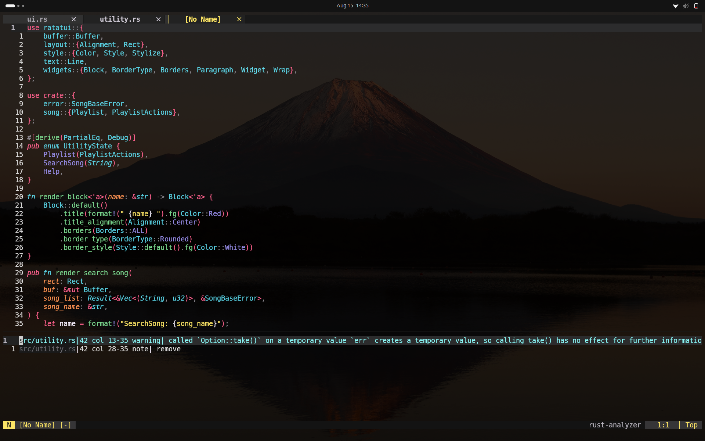
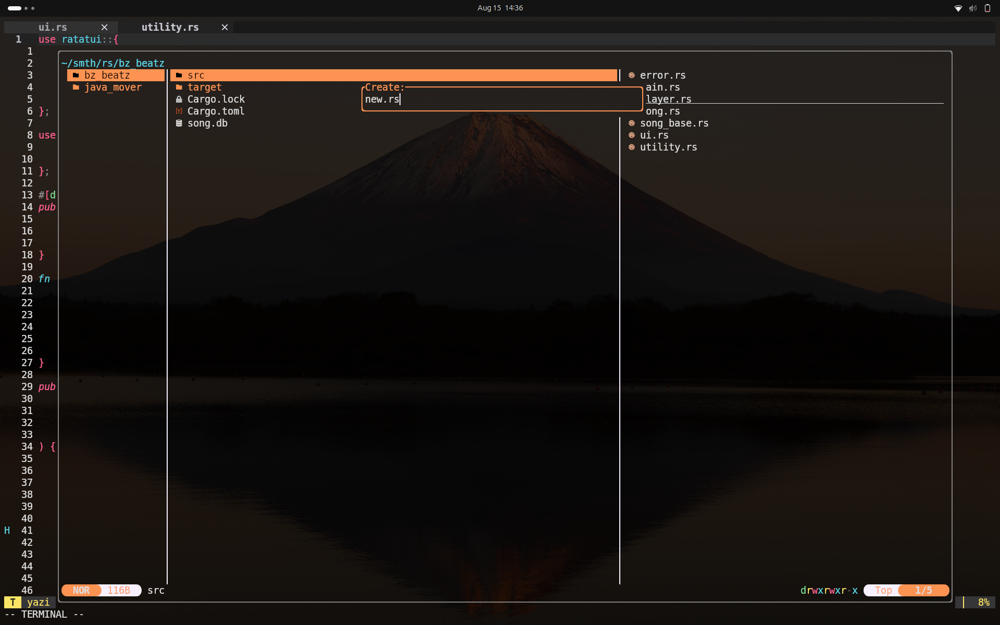
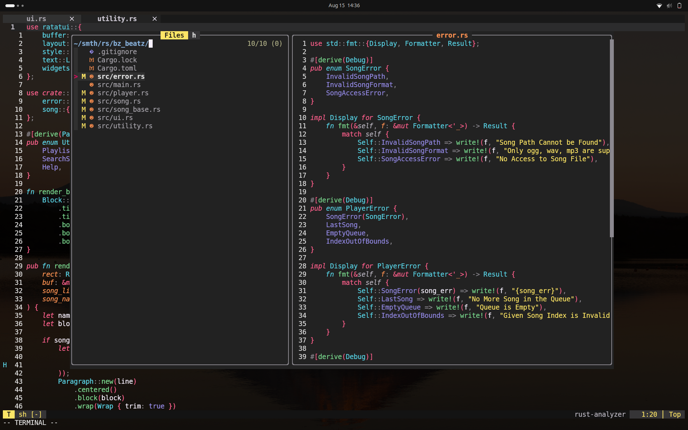

# nvim_config

> A simple, personal Neovim setup focused on productivity, code clarity, and modern plugin goodness.

---
## 📚 Table of Contents

- [🖼️ Previews](#previews)
- [✨ Plugins](#plugins)
- [🎹 Keymaps](#keymaps)
- [⚡️ Quick Start](#quick-start)
- [🛠️ Tools Needed](#tools-needed)

---

## 🖼️ Previews

---

## ✨ Plugins

Here's a quick human-friendly rundown of the main plugins used in this config and what they do for you:

- **Theme & UI**
  - `monokai-pro.nvim`: Monokai Pro color scheme for a pleasant coding vibe.
  - `bufferline.nvim`: Beautiful buffer/tab line for easy navigation.
  - `lualine.nvim` (+ `lualine-lsp-progress`): Clean status line with LSP info.
  - `fzf-lua`: Blazing fast fuzzy file/symbol/buffer search.

- **Editing & Navigation**
  - `nvim-autopairs`: Auto-insert matching pairs (quotes, brackets, etc.).
  - `Comment.nvim`: Quick line/block commenting.
  - `yazi.nvim` + `oil.nvim`: Modern file explorer and manager.
  - `nvim-treesitter`: Smart syntax highlighting and code selection.

- **Language Support & LSP**
  - `nvim-lspconfig`: Powerful Language Server Protocol integration.
  - `mason.nvim`: Easy installation of language servers and formatters.
  - `rustaceanvim`: Rust language support.
  - `nvim-jdtls`: Java language support.

- **Completions & Snippets**
  - `blink.cmp`: Fast autocompletion.
  - `LuaSnip` + `friendly-snippets`: Snippet management.

- **Linting & Formatting**
  - `conform.nvim`: Auto-format your code on save (supports Lua, Rust, Python, HTML, CSS, etc.).
  - `nvim-lint`: On-the-fly linting for many languages.

- **Markdown**
  - `render-markdown.nvim`: Pretty markdown rendering in Neovim.

---

## 🎹 Keymaps

Some of the most useful keybindings (custom & plugin-powered):

### Global & Navigation

- `<Esc>`: Clear search highlight (normal) / exit terminal mode (terminal)
- `<Tab>` / `<S-Tab>`: Next/previous buffer
- `<C-q>`: Close current window
- `<C-Left/Down/Up/Right>`: Move between windows
- `<leader>x`: Close current buffer

### Buffer & File Management

- `<leader>f`: Fuzzy search files
- `<leader>b`: Switch buffers
- `<leader>l`: Live grep (search in files)
- `<leader>s`: Search document symbols
- `<leader>S`: Search workspace symbols
- `<leader>d`: Search document diagnostics
- `<leader>D`: Search workspace diagnostics
- `<leader>t`: Search tags

### Comments

- `<leader>/l`: Toggle line comment (normal/visual)
- `<leader>/b`: Toggle block comment (normal/visual)

### Window Sizing

- `<M-Up/Down/Right/Left>`: Resize window height/width

### LSP (Language Features)

- `gd`: Go to definition
- `gr`: Go to references
- `gi`: Go to implementation
- `gs`: Go to symbols
- `gt`: Go to type definition
- `K`: Hover documentation
- `<C-k>`: Signature help
- `<leader>rn`: Rename symbol
- `<leader>ca`: Code action
- `[d` / `]d`: Previous/next diagnostic
- `<leader>e`: Show error details
- `<leader>q`: Diagnostics quickfix list
- `<leader>gf`: Format document

### Miscellaneous

- `<leader>cr`: Compile & Run current file (C, C++, Python, Rust, Java, Bash)
- `<leader>cp`: Copy current file's directory to clipboard

---

## ⚡️ Quick Start

1. Clone this repo into your Neovim config directory.
2. Run `:Mason` to install needed language servers.
3. Open Neovim and start coding!

---

## 🛠️ Tools Needed

To get the best out of this config, make sure you have these installed on your system:

- **fd** (for fast file searching)
- **bat** (for pretty file previews in fzf-lua)
- **rg** (fast grep)
- **yazi** (terminal file explorer)
- **Node.js** & **npm** (some LSPs, formatters, and linters)

Most language servers, formatters, and linters can be installed via `:Mason` inside Neovim!

---

##  Customization

Feel free to tweak keymaps or plugins to your taste. Everything is organized under `lua/config` (for general config) and `lua/plugins` (for plugins).

---

**Happy coding! 🚀 If you have questions, open an issue or ping me!**
